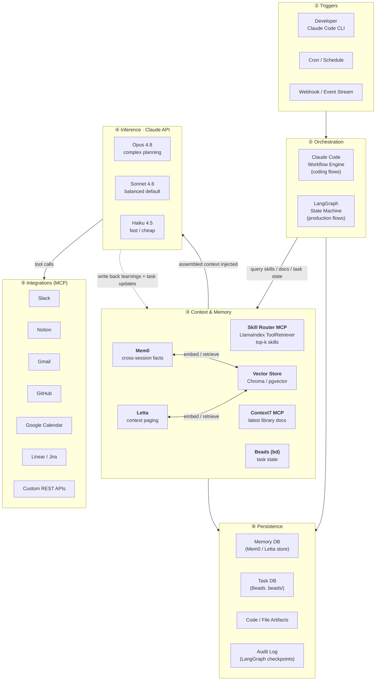
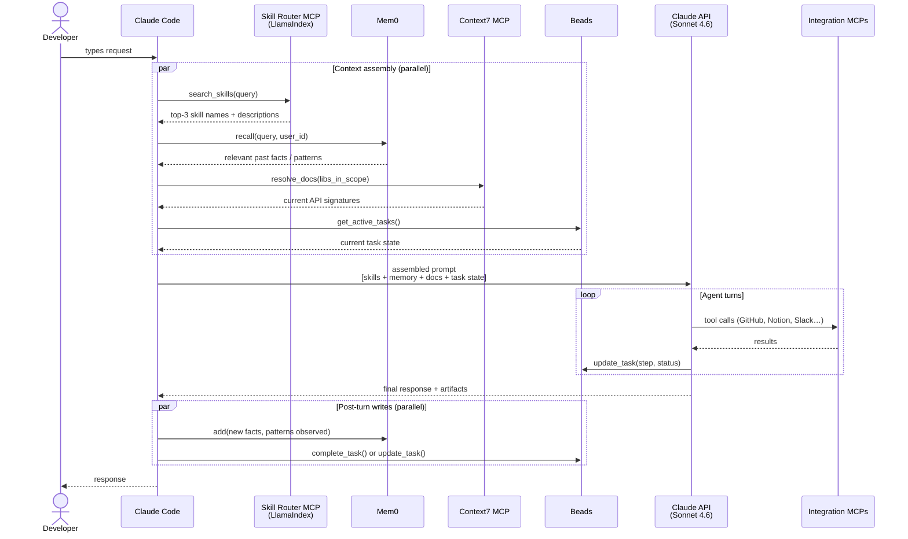
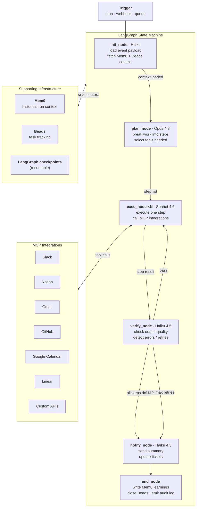

_created_at: 2026-06-17_

# Agent Infrastructure Architecture

Full-stack reference for building Claude-powered agents with semantic skill discovery, persistent memory, and external integrations. Covers two primary workflow patterns: **coding** (Claude Code / developer-facing) and **production** (automated / event-driven).

---

## System Overview



---

## Workflow A — Coding (Claude Code / Developer-Facing)

Each developer turn assembles context from three sources before inference: skills, memory, and docs. The agent never sees the full skill pool — only what the router returns.



### Key decisions in coding flows

| Decision | Choice | Why |
|---|---|---|
| Model for most tasks | Sonnet 4.6 | Balanced cost/quality for tool-heavy coding turns |
| Model for hard planning | Opus 4.8 | Architecture decisions, ambiguous requirements |
| Model for quick checks | Haiku 4.5 | Lint feedback, classification, fast validation |
| Skill discovery | LlamaIndex ToolRetriever via MCP | Never loads all 200 skills; top-k injected on demand |
| Memory | Mem0 | Extracts facts automatically; no manual annotation |
| Context window management | Handoff pattern from `learnings.md` | At ~75% usage, emit structured HandoffPayload; orchestrator spins new agent |

---

## Workflow B — Production System (Automated / Event-Driven)

LangGraph owns the state machine. Each node is a discrete Claude call; checkpoints make the flow resumable. Mem0 provides history that spans multiple past runs.



### Context window handoff in production flows

LangGraph checkpoints handle resumability at the *flow* level, but individual nodes still hit context limits. Apply the handoff pattern from `learnings.md`:

```
plan_node emits → PlanPayload { steps[], tools[], constraints[] }
exec_node(n) emits → StepPayload { completedSteps[], pendingSteps[], artifacts{}, criticalContext{} }
verify_node receives StepPayload directly — never the full history
```

This keeps each node's input bounded regardless of how long the overall run is.

---

## Library Stack Summary

```
┌─────────────────────────────────────────────────────────────────┐
│  Inference                                                      │
│  Anthropic SDK  ·  claude-opus-4-8 / sonnet-4-6 / haiku-4-5    │
├─────────────────────────────────────────────────────────────────┤
│  Orchestration                                                  │
│  Claude Code Workflow Engine  (coding flows)                    │
│  LangGraph  (production flows, stateful, resumable)             │
├─────────────────────────────────────────────────────────────────┤
│  Skill / Tool Discovery                                         │
│  LlamaIndex ToolRetrieverMixin  ←→  Skill Router MCP server    │
│  Indexes: skill name + description + trigger patterns           │
│  Returns: top-k relevant skills, loaded into context on demand  │
├─────────────────────────────────────────────────────────────────┤
│  Memory                                                         │
│  Mem0  (cross-session, automatic fact extraction)               │
│  Letta  (long-running agents, virtual context paging)           │
│  Vector backend: Chroma (local dev)  ·  pgvector (production)  │
├─────────────────────────────────────────────────────────────────┤
│  Task State                                                     │
│  Beads (bd)  ←  source of truth for in-progress work           │
├─────────────────────────────────────────────────────────────────┤
│  Docs / Reference                                               │
│  Context7 MCP  ←  always-current library docs                  │
├─────────────────────────────────────────────────────────────────┤
│  External Integrations  (all via MCP servers)                  │
│  Slack · Notion · Gmail · GitHub · Google Calendar             │
│  Linear · Custom REST APIs                                      │
└─────────────────────────────────────────────────────────────────┘
```

---

## Build Order

Start here if building from scratch. Each layer depends on the one below it.

1. **Anthropic SDK** — wire up Claude API, confirm model calls work
2. **Beads** — `bd init` in each project; task state before anything else
3. **Mem0** — add memory writes after each agent turn; reads at prompt assembly
4. **Skill Router MCP** — index existing skills with LlamaIndex; expose `search_skills` as MCP tool
5. **Context7** — configure MCP server; inject doc snippets for libs in scope
6. **LangGraph** — wrap production flows in state machines; add checkpointing
7. **MCP Integrations** — add external tools one at a time as needed

Resist adding all layers at once. The value compounds: you need memory before you can benefit from skill routing, and you need both before LangGraph orchestration pays off.

---

## Files in This Directory

| File | Description |
|---|---|
| `ARCHITECTURE.md` | This file — full infrastructure diagram and workflow patterns |
| `learnings.md` | Hard-won context management patterns (handoff, summarization, paging) |
| `extensions/AGENTS.md` | Which tools, MCPs, and skills agents should use |
| `prompts/STANDARDS.md` | Prompt quality standards for reusable prompt files |
| `subagents/usemybrain.md` | Subagent configuration |
| `skills/` | Local skill definitions |
